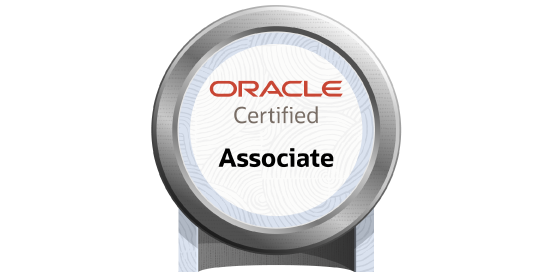

# 👋 ¡Hola! Soy Neider López

[](https://www.linkedin.com/in/lpzneider)
[](mailto:lpzneider@gmail.com)
[](https://education.oracle.com/oracle-certified-associate-java-se-8-programmer/trackp_333)
[-green?style=for-the-badge&logo=googlemaps)]()

## 🚀 Desarrollador Java con WebFlux

> **Especialista en programación reactiva y arquitecturas escalables**

Desarrollador Java con **+2.5 años de experiencia** construyendo microservicios escalables y robustos. Apasionado por el **código limpio**, **arquitecturas reactivas** y la **entrega continua de valor**.

---

## 💻 Stack Tecnológico

### **Backend & Core**


### **Frontend**


### **Cloud & DevOps**


### **Bases de Datos**


### **Testing & Quality**


---

## 🎯 Principios & Metodologías

```java
public class DeveloperProfile {
    private final List<String> principles = Arrays.asList(
        "SOLID", "Clean Code", "DDD", "Clean Architecture",
        "Test-Driven Development", "Reactive Programming"
    );
    
    private final List<String> methodologies = Arrays.asList(
        "Scrum", "Kanban", "CI/CD", "GitFlow"
    );
    
    public void developWithQuality() {
        principles.forEach(this::apply);
        methodologies.forEach(this::follow);
    }
}
```

---

## 💼 Experiencia Profesional

### 🏢 **Soaint Software Associates S.A.S.**
**Desarrollador Full Stack / Backend Java** | *06/2024 - 06/2025* | *Remoto*

- 🔄 **Microservicios Reactivos**: Java 17 + Spring Boot + WebFlux
- 🏗️ **Arquitecturas Limpias**: Implementación de principios SOLID y patrones de diseño
- ✅ **Testing Completo**: JUnit para pruebas unitarias y funcionales
- 🚀 **CI/CD**: Automatización con Jenkins y GitHub Actions
- ☁️ **AWS Services**: SNS, SQS, ECS, Fargate, CloudWatch
- 🎨 **Frontend**: Desarrollo de interfaces con Angular
- 🏆 **Reconocimiento**: Por calidad en entregables y resolución ágil de incidencias

### 🏢 **A&A Freedom Solutions SAS**
**Desarrollador Java** | *01/2023 – 05/2024* | *Remoto*

- ⚡ **Programación Reactiva**: Spring WebFlux en AWS
- 🔧 **Integración Cloud**: S3, Lambda, CloudWatch
- 🌐 **Servicios REST**: Diseño con bajo acoplamiento
- 🔄 **Refactorización**: Orientada a principios SOLID
- 🗄️ **Optimización DB**: Consultas SQL y procedimientos almacenados
- 🔄 **DevOps**: Automatización con Jenkins

---

## 🎓 Formación Académica

### **SENA - Tecnólogo en Análisis y Desarrollo de Software**
*09/2022 - 12/2024* | **Graduado** 🎉

- 💡 Fundamentos de programación y estructuras lógicas
- 🌐 Desarrollo web y APIs
- 🧪 Pruebas y testing
- 👥 Proyectos colaborativos con enfoque práctico

---

## 📜 Certificaciones & Cursos

### **🏆 Certificaciones Oficiales**
- **Oracle Certified Associate, Java SE 8 Programmer** - Oracle | 2025

### **📚 Cursos Especializados**
- **Spring Boot & Spring WebFlux Programación Reactiva RESTful** - Udemy | 2025
- **Ruta de Aprendizaje de Desarrollo Backend con Java** - Platzi | 2025
- **Java Spring Security: Autenticación y Seguridad Web** - Platzi | 2025
- **Java Spring Data JPA: Bases de Datos** - Platzi | 2025
- **Curso Profesional de Java** - Platzi | 2024
- **Java Spring** - Platzi | 2024
- **Estructuras de Datos y Algoritmos Avanzados** - Platzi | 2024
- **Microservicios con Docker & Kubernetes** - Udemy | 2024
- **Spring Framework 6 & Spring Boot 3** - Udemy | 2024

---

## 🚀 Proyectos Destacados

### 🏢 [Franchise Management System](https://github.com/LPZneider/franchise-system)
Sistema de gestión de franquicias con **arquitectura hexagonal** y **programación reactiva**.

**Stack**: Java 21, Spring Boot 3.5.4, Spring WebFlux, MongoDB, Docker, AWS Lightsail

**Características**:
- ✅ Arquitectura Hexagonal (Clean Architecture)
- ⚡ Programación Reactiva con WebFlux
- 🐳 Containerización con Docker
- ☁️ Despliegue en AWS Lightsail
- 📖 Documentación completa con Postman
- 🧪 Cobertura de pruebas del 100%

**Demo en vivo**: [http://44.201.59.135:8001/api/v1/franchises](http://44.201.59.135:8001/api/v1/franchises)

---

## 🏆 Certificación Oracle

<div align="center">



**Oracle Certified Associate, Java SE 8 Programmer** - Oracle | 2025

</div>

---

## 🌟 ¿Qué me caracteriza?

```java
@Component
public class DeveloperMindset {
    
    @Value("${developer.passion}")
    private String passion = "Clean Code & Quality";
    
    @Value("${developer.focus}")
    private String focus = "Continuous Learning";
    
    @Autowired
    private ProblemSolvingSkills problemSolving;
    
    @Autowired
    private TeamCollaboration teamWork;
    
    public void deliver() {
        while (true) {
            learn();
            code();
            test();
            improve();
        }
    }
}
```

- 🎯 **Orientado a resultados**: Entrega de valor continuo
- 🧠 **Aprendizaje constante**: Siempre actualizándome con las últimas tecnologías
- 🤝 **Trabajo en equipo**: Colaboración efectiva y comunicación clara
- 🔍 **Atención al detalle**: Código limpio y mantenible
- ⚡ **Resolución ágil**: Identificación y solución rápida de problemas

---

## 📫 ¡Conectemos!

<div align="center">

[](https://www.linkedin.com/in/lpzneider)
[](mailto:lpzneider@gmail.com)
[](https://github.com/lpzneider)
[](https://wa.me/573154682507)

</div>

---

<div align="center">

**💼 Disponible para nuevas oportunidades | 🌍 Remoto | 📍 Bogotá, Colombia**

*"La calidad no es un acto, es un hábito."* - Aristóteles


</div>
